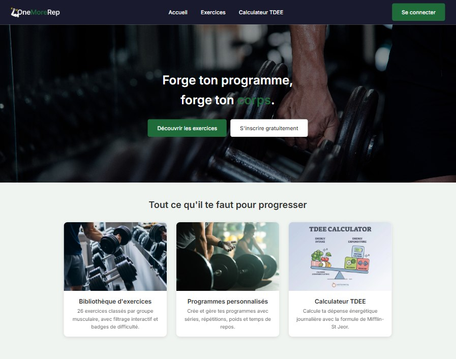

# OneMoreRep

[](https://github.com/slayerfx/onemorerep/actions/workflows/ci.yml)
[](LICENSE)

Forge your program, forge your body.

Strength training site: create an account, browse an exercise library, build custom
workout programs, compute your total daily energy expenditure (TDEE) and find a gym
near you on an interactive map. User and administrator roles are separated.

**🔗 Live site:** https://onemorerep.infinityfree.io

Final project of my training — Louenn Penanc'hoat, BRE05 3W Academy



## Tech stack

- PHP 8.3+ (MVC architecture, no framework)
- MySQL 8.x through PDO (prepared statements)
- `.phtml` templates (layout + partials)
- Native CSS (mobile-first, Flexbox, Grid)
- Vanilla JavaScript (Fetch API)
- Session-based authentication — `password_hash()` / `password_verify()`, an enforced
  password policy, and separate user and administrator roles
- Leaflet.js over OpenStreetMap tiles, with nearby gyms queried live from the
  [Overpass API](https://wiki.openstreetmap.org/wiki/Overpass_API)
- Composer (vlucas/phpdotenv)
- PHPUnit for the unit tests

To run it locally you need PHP 8.3 or later, MySQL 8.x, Composer and a local
server (Laragon, WAMP, XAMPP or MAMP).

## Local installation

**1. Clone the repository**

```bash
git clone https://github.com/slayerfx/onemorerep.git
cd onemorerep
```

**2. Install the PHP dependencies**

```bash
composer install
```

**3. Create the environment file**

Copy `.env.example` to `.env` and fill in your database credentials.

```bash
cp .env.example .env
```

```
DB_HOST=localhost
DB_NAME=onemorerep
DB_CHARSET=utf8mb4
DB_USER=root
DB_PASSWORD=
```

**4. Import the database**

In phpMyAdmin: create a database named `onemorerep` (the "Databases" tab), select
it, then the "Import" tab, pick `onemorerep.sql` and run it. The file holds 5
tables plus a set of test data; since every table is recreated through
`DROP TABLE IF EXISTS`, it can be re-imported at any time to reset the database.

**5. Start the local server**

Put the project in your local server's folder (e.g. `C:\laragon\www\onemorerep`)
and open `http://localhost/onemorerep`.

## Test accounts

| Role | Email | Password |
|------|-------|----------|
| Admin | louenn@onemorerep.fr | Test1234! |
| User | sarah@test.fr | Test1234! |

These credentials are for the local demo only. In production the administrator
password must be replaced with a private one that never appears in the
repository.

## Tests

The unit tests (PHPUnit) cover the TDEE computation following the Mifflin-St Jeor
formula, for both the male and female cases. To run them:

```bash
composer test
```

CI replays them on PHP 8.3 and 8.4 on every push.

## Deployment

The site is hosted on InfinityFree. The full procedure — remote database, FTP
transfer, production `.env` — sits in
[docs/DEPLOYMENT.md](docs/DEPLOYMENT.md).

## Project layout

```
onemorerep/
├── index.php              Single entry point
├── config/                Configuration and autoload
├── controllers/           MVC controllers
├── managers/              Database access (PDO)
├── models/                PHP classes (domain objects)
├── services/              Router and services
├── templates/             .phtml templates (layout, partials, pages)
├── assets/                CSS, JavaScript, images
├── tests/                 PHPUnit unit tests
├── docs/                  Deployment procedure
├── .github/workflows/     Continuous integration
├── composer.json          Dependencies and the test script
├── phpunit.xml            PHPUnit configuration
└── onemorerep.sql         Database SQL script
```

## Licence

The code in this repository is published under the [MIT](LICENSE) licence.

The photographs in `assets/images/` come from stock image banks and remain
subject to their own licences: they are not covered by the repository's MIT
licence.
